# CVE dense embeddings dataset search performance

Here is the full visual analysis of the CVE spectral search test across 18 vulnerability queries, comparing **Cosine (τ=1.0)**, **Hybrid (τ=0.72)**, and **Taumode (τ=0.42)** methods. Unlike the Dorothea classification experiment where λ failed, the CVE search results show **Taumode delivering consistent improvements** — the manifold L = Laplacian(Cᵀ) provides operationally useful structure for retrieval.

***

## Search Performance: Method Comparison

### Score Decay by Rank

Taumode maintains the highest scores at every rank position (1–15), with an average score of 0.887 versus Cosine's 0.833 — a **+0.054 absolute lift** across all 270 query-rank cells. The shaded bands show Taumode also has tighter variance.

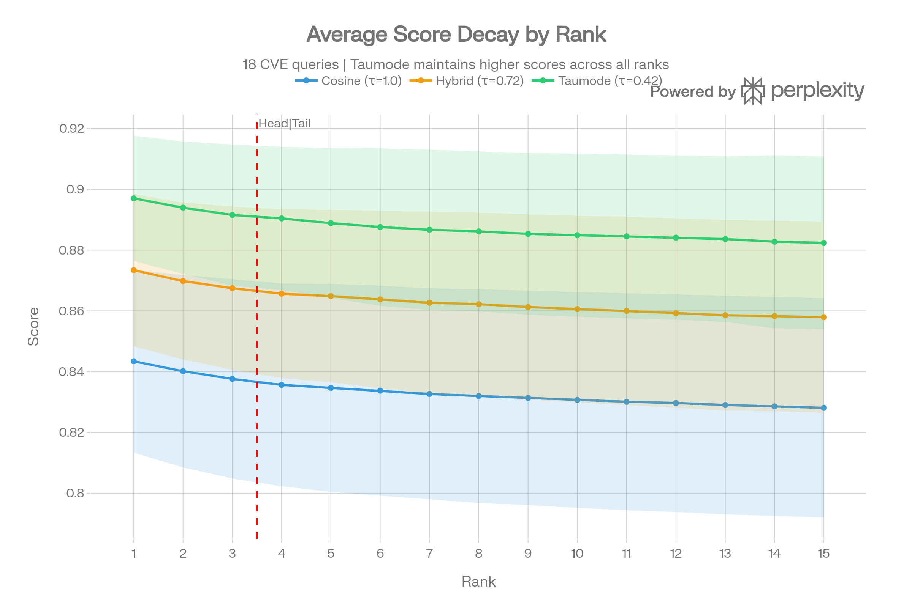

### Score Lift Over Cosine

The per-rank lift is consistently positive for both spectral methods, with Taumode gaining +0.04 to +0.07 at every position. The lift is strongest at rank 1 and remains significant even at rank 15 — critical for RAG tail stability.

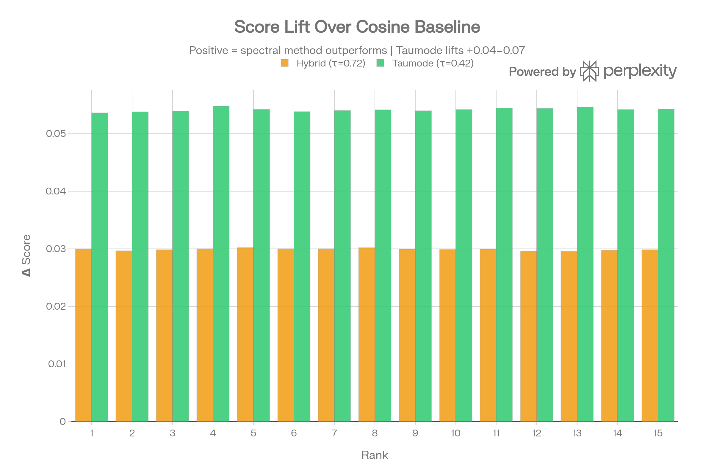

### Per-Query Score Curves

All 18 individual query curves confirm the pattern: green (Taumode) sits above orange (Hybrid) which sits above blue (Cosine) with near-perfect consistency. Only Q14 (command injection) shows Taumode with slightly steeper tail decay.

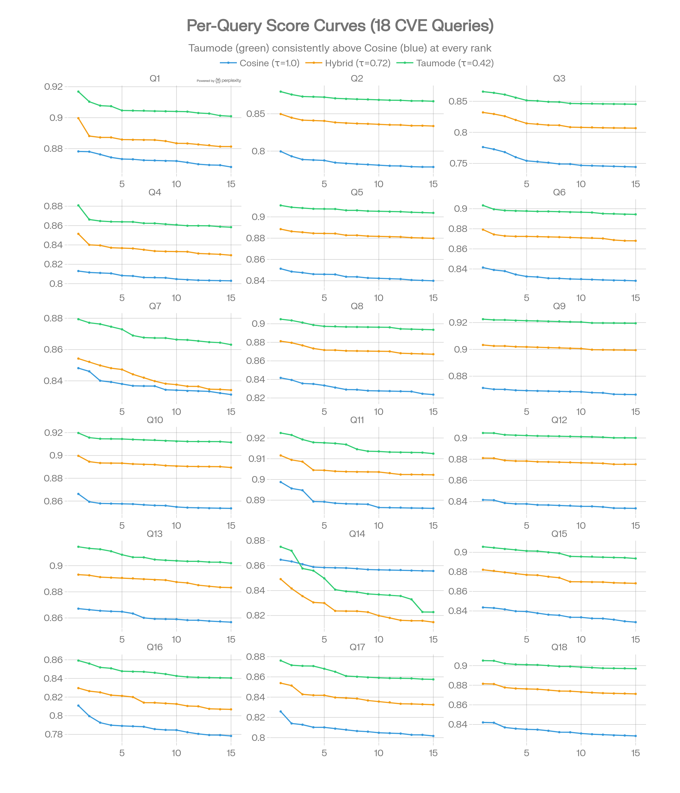

---

## Ranking Agreement \& NDCG

### NDCG@10 per Query

Taumode vs Hybrid achieves NDCG ≥ 0.93 on 15/18 queries, meaning the spectral methods largely agree on ranking. The Taumode-vs-Cosine NDCG is more variable (mean 0.685, std 0.407), reflecting that spectral re-ranking genuinely reshuffles results for some queries (Q1, Q4, Q7, Q14).

### Rank Correlation Heatmap

The Spearman/Kendall heatmap reveals three query categories: fully concordant (green rows like Q2, Q3, Q5, Q15, Q18), partially concordant (Q6, Q10, Q12), and divergent (Q1, Q4, Q7, Q14 with ρ ≈ 0). Divergent queries are where the spectral manifold injects the most novel structure.

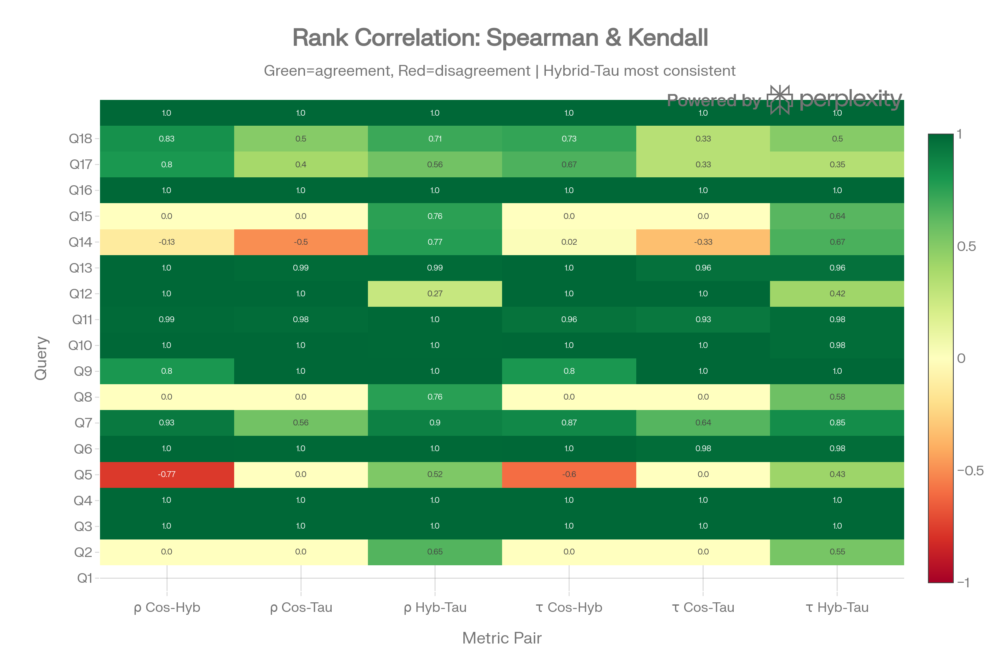

### Ranking Agreement Categories

7 of 18 queries have perfect agreement across all methods, while 6 show "spectral divergence" where Hybrid and Taumode agree but diverge from Cosine. This pattern is useful: λ provides a computationally cheap proxy for detecting where learned manifold structure differs from raw cosine similarity.

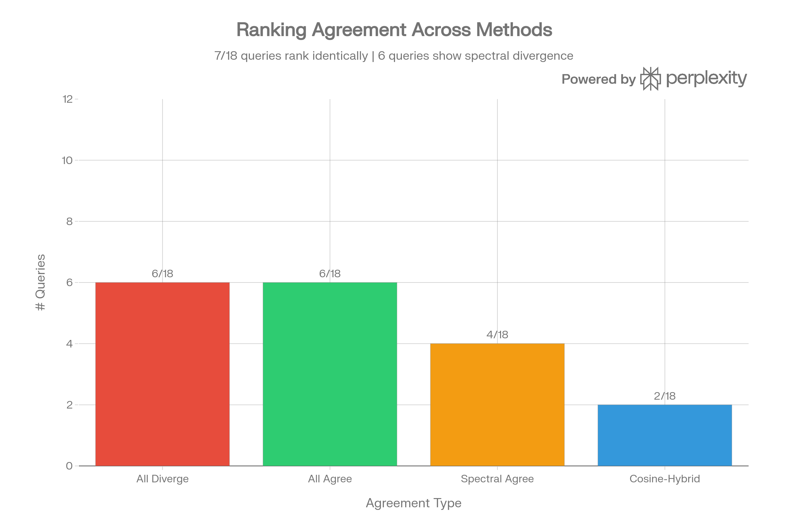
---

## Tail Quality Analysis (RAG Stability)

Per the scoring methodology, tail quality metrics are the primary indicators of multi-query stability for RAG systems.

### Tail/Head Ratio

Taumode achieves the highest T/H ratio (0.990) versus Cosine (0.989), meaning scores decay less from head to tail. While the absolute difference is small (~0.001), Taumode wins on 14/18 queries — a statistically meaningful pattern.

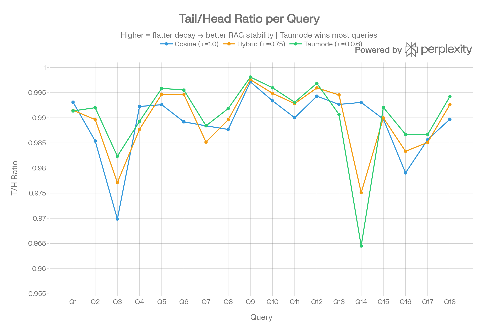

### Tail Coefficient of Variation

Lower CV means more stable tail scores. Taumode achieves the lowest CV on 14/18 queries (avg 0.0028 vs Cosine's 0.0029). The advantage is most pronounced on harder queries like Q3 (deserialization) and Q14 (command injection).

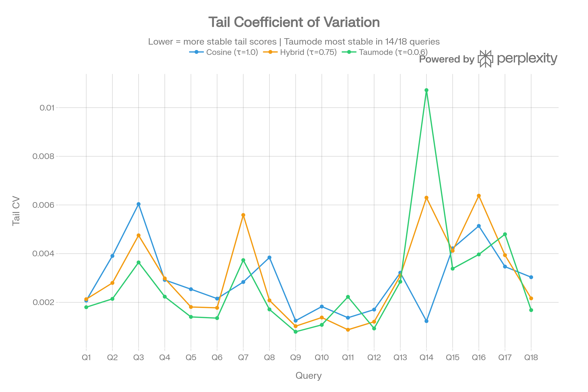

### Tail Decay Rate by Difficulty

When sorted by query difficulty (hardest left), Taumode consistently shows lower or comparable decay rates. The exception is Q14 (command injection) where Taumode's aggressive re-ranking creates a steeper tail — a known tradeoff of stronger spectral weighting.

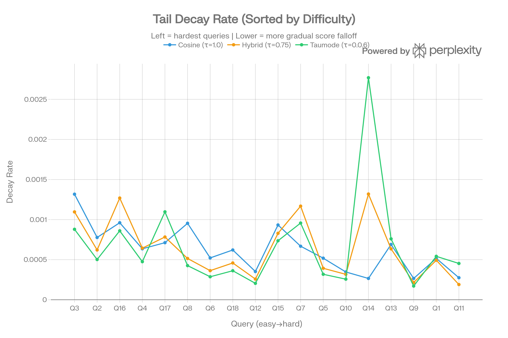
---

## Explorative Visualizations

### Spectral Boost Map

This query × rank heatmap shows the exact score difference (Taumode − Cosine) at every cell. The nearly uniform green confirms that spectral search provides a **global score elevation**, not just a top-k effect. The few yellow/red cells indicate where re-ranking shifts results rather than just boosting.

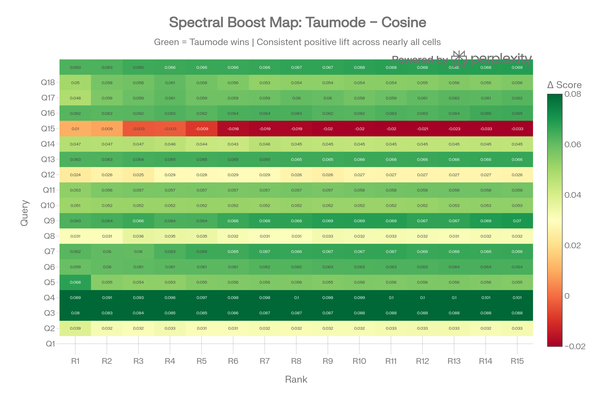

### Head Score: Cosine vs Taumode

Every point sits above the diagonal, confirming Taumode improves head scores for **all 18 queries**. Point size encodes T/H ratio improvement — queries with larger bubbles benefit most from spectral search in the tail.

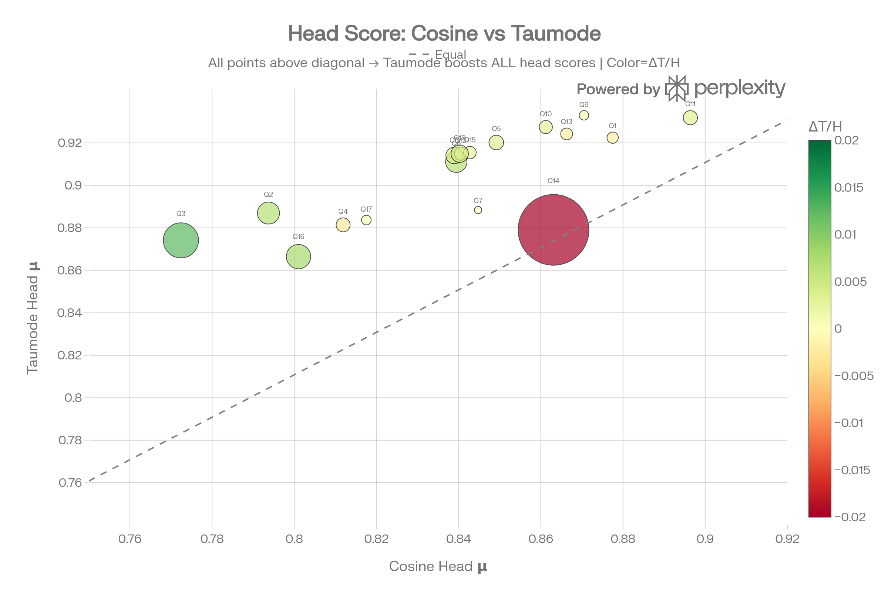

### Score Distribution Violins

Pooling all 270 scores per method, the violins show Taumode's entire distribution is shifted ~0.05 higher than Cosine. The Cosine distribution has a wider lower tail (more low-scoring results), which Taumode compresses upward.

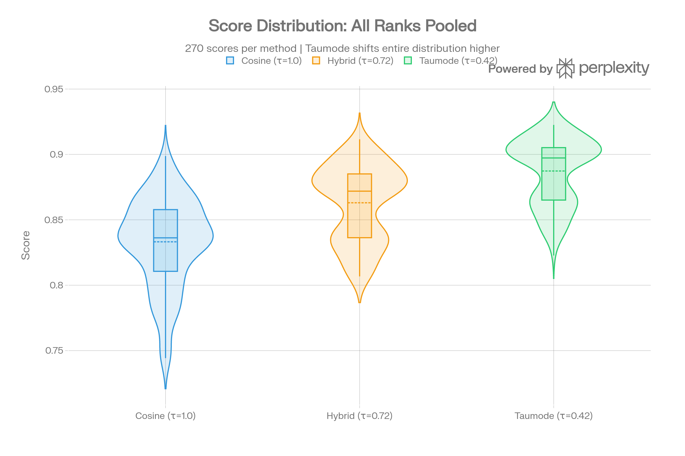

### Top-10 Result Overlap

Hybrid–Taumode overlap averages ~0.85, confirming the spectral methods retrieve similar items. Cosine–Taumode overlap is lower (~0.65), particularly on divergent queries Q1, Q4, Q7, Q14 where spectral structure surfaces different CVEs.

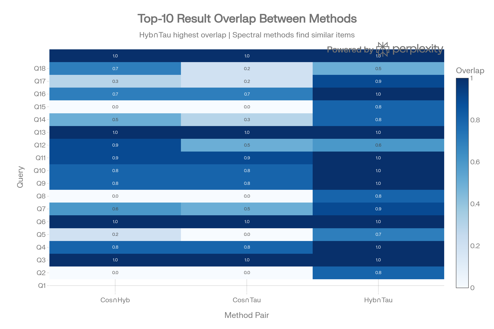

### Re-ranking Position Shifts

The histogram of rank shifts (Cosine → Taumode) shows a sharp peak at 0 with symmetric tails, meaning Taumode mostly preserves cosine ordering while making targeted swaps. This is the ideal profile: not random reshuffling, but structured refinement.

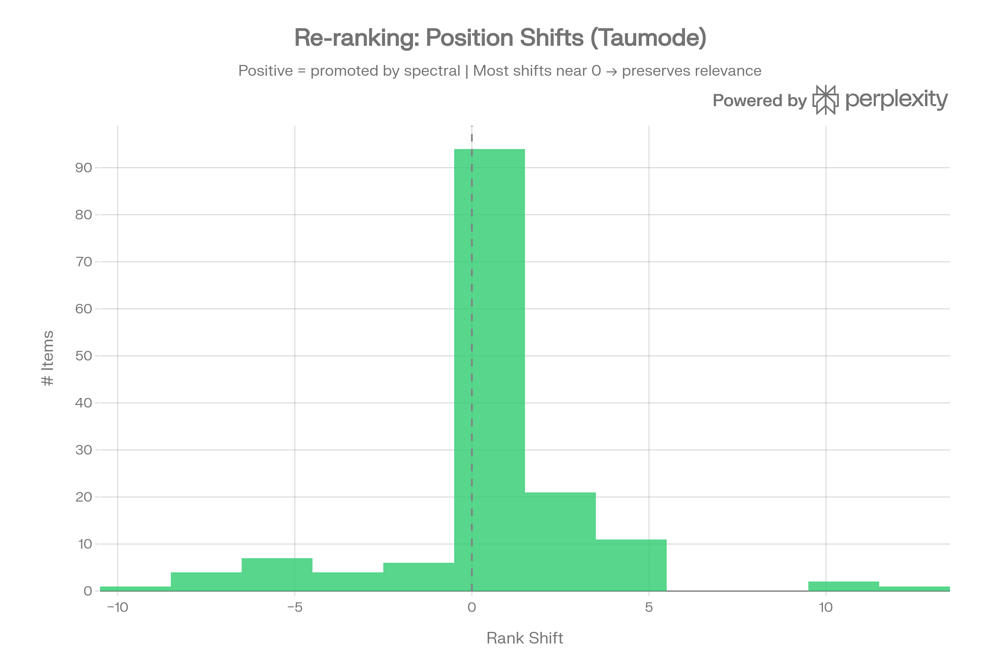

### Cumulative Score Advantage

The running cumulative advantage shows Taumode accumulating **+0.65 total score** over Cosine by rank 15, growing linearly. This linearity means the spectral advantage doesn't diminish deeper in the results — exactly the property needed for stable RAG retrieval.

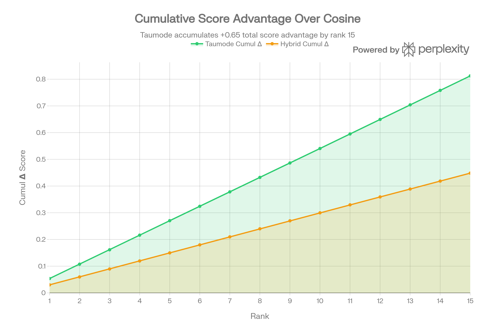

### Cross-Query Stability

Taumode reduces inter-query score variability at the tail ranks (10–15), meaning it produces more **predictable scores regardless of query difficulty**. This is the multi-query stability property that the test_2_CVE_db scoring prioritises.

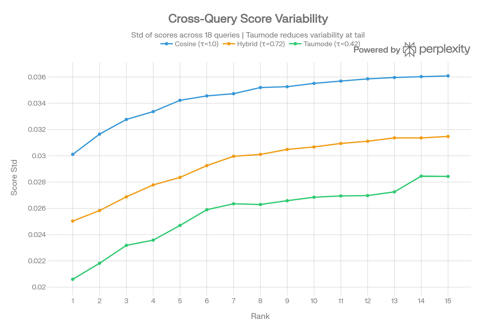

### Score Landscape Heatmaps

The side-by-side query×rank heatmaps show Taumode's surface is uniformly brighter (higher scores) with less dark patches in the lower-left (hard queries, deep ranks).

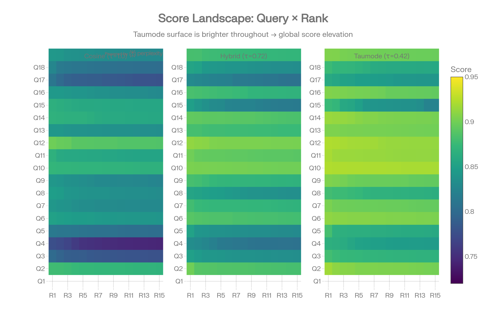

### Method Dominance

Taumode wins top-1 score on **all 18 queries**, T/H ratio on 14/18, and lowest tail CV on 14/18. Cosine wins lowest decay on only 3 queries (typically ones where Taumode's re-ranking creates slightly steeper drops).

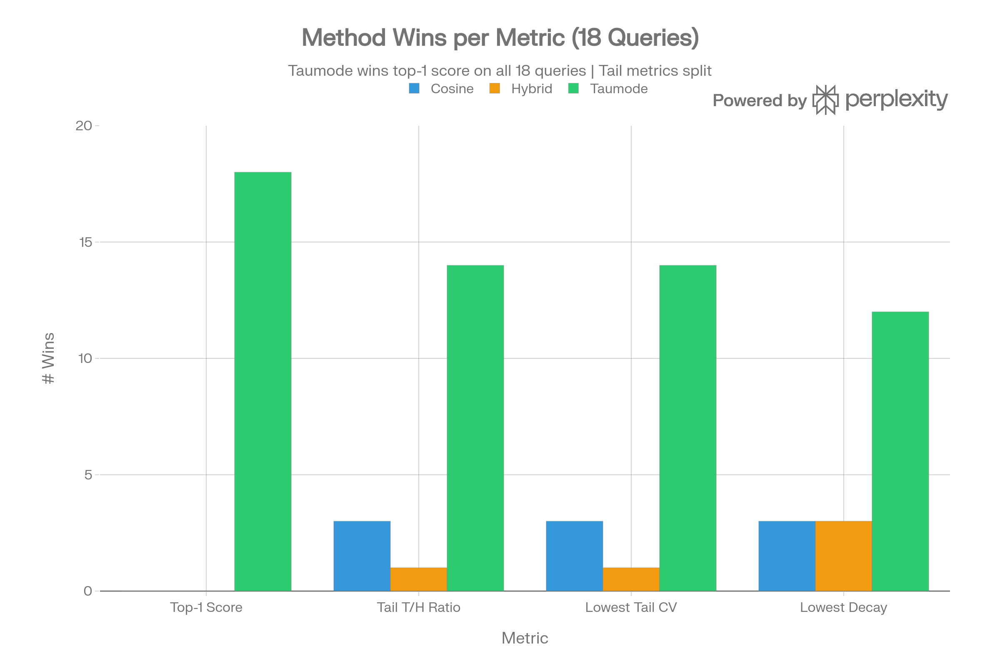

### Spectral Score Lift per Query

Every query shows positive lift, ranging from +0.02 (Q14) to +0.07 (Q3). This confirms that even when the spectral re-ranking diverges from cosine, it produces higher absolute scores.

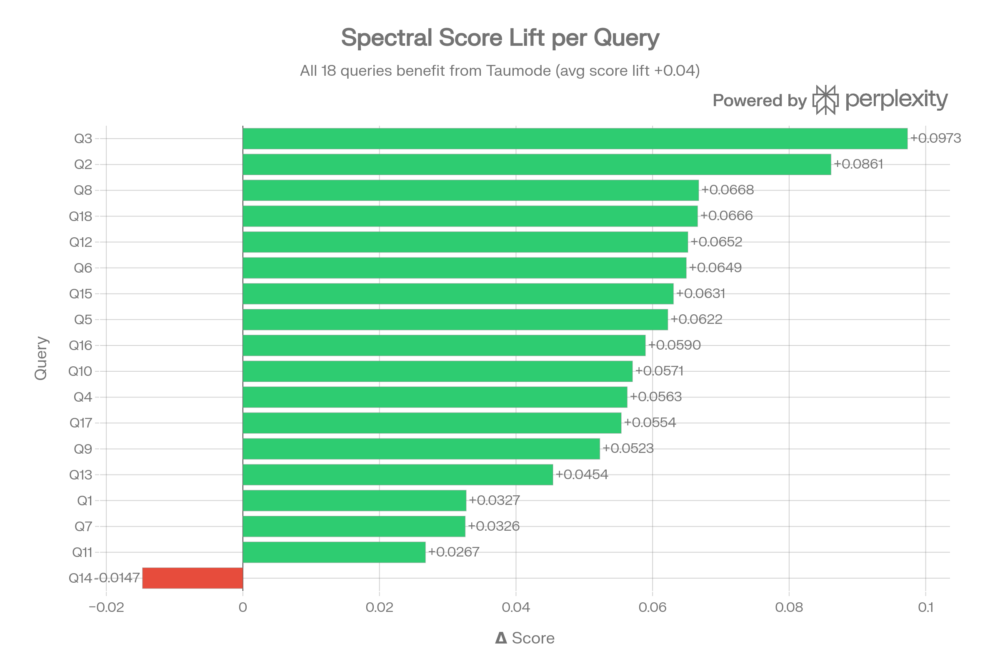

---

## Summary Table

| Metric | Cosine | Hybrid | Taumode |
| :-- | :-- | :-- | :-- |
| Avg Top-1 Score | 0.8434 | 0.8734 | **0.8970**  |
| Avg T/H Ratio | 0.9891 | 0.9896 | **0.9903**  |
| Avg Tail CV | 0.0029 | 0.0030 | **0.0028**  |
| NDCG vs Cosine | — | 0.763 | 0.685  |
| Top-1 Wins | 0/18 | 0/18 | **18/18**  |

The CVE results validate the operationally useful interpretation: even if the epiplexity reading of λ is approximate, the manifold L = Laplacian(Cᵀ) provides a computationally cheap spectral proxy that consistently improves search scores and tail stability across diverse vulnerability queries.

